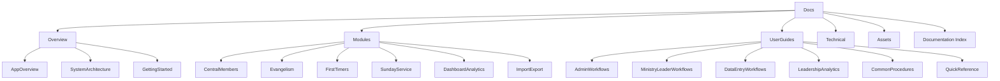

# Church Management Tracker — Documentation Hub

Welcome to the documentation hub for the Church Management Tracker. This site provides structured, cross-linked guidance for decision-makers, ministry leaders, administrators, and developers.

## Purpose and scope

This documentation helps you:
- Understand the application vision, architecture, and capabilities
- Navigate module features and operational workflows
- Configure, maintain, and evolve the system safely
- Find answers quickly through an indexed, cross-referenced structure

Scope covers overview, modules, user workflows, and technical guidance. Visual assets that support this documentation are organized under Assets.

## How to use this documentation

- By audience
  - Church leadership: start with Overview to understand value and architecture
  - Administrators: use User Guides for procedures, then Technical for deployment and guardrails
  - Ministry leaders and data entry teams: follow User Guides for day-to-day workflows
  - Developers: read Overview then Technical for architecture, data, and code practices
- Navigation conventions
  - All links are relative within docs/
  - Each section provides a link back to this home page
  - A complete alphabetical index and cross-reference table is available in Documentation Index

## Quick links

- Overview
  - [Application Overview](./overview/application-overview.md)
  - [System Architecture](./overview/system-architecture.md)
  - [Getting Started](./overview/getting-started.md)
- Modules
  - [Central Members](./modules/central-members.md)
  - [Evangelism](./modules/evangelism.md)
  - [First Timers](./modules/first-timers.md)
  - [Sunday Service](./modules/sunday-service.md)
  - [Dashboard Analytics](./modules/dashboard-analytics.md)
  - [Import Export](./modules/import-export.md)
- User Guides
  - [Administrative Workflows](./user-guides/administrative-workflows.md)
  - [Ministry Leader Workflows](./user-guides/ministry-leader-workflows.md)
  - [Data Entry Workflows](./user-guides/data-entry-workflows.md)
  - [Leadership Analytics](./user-guides/leadership-analytics.md)
  - [Common Procedures](./user-guides/common-procedures.md)
  - [Quick Reference](./user-guides/quick-reference.md)
- Technical
  - [Technical Overview](./technical/README.md)
- Index
  - [Documentation Index](./documentation-index.md)

## Navigation index

- [Overview](./overview/): executive summary, system architecture, getting started
- [Modules](./modules/): functional deep-dives for Central Members, Evangelism, First Timers, Sunday Service, Dashboard Analytics, Import Export
- [User Guides](./user-guides/): role-based procedures and common workflows
- [Technical](./technical/): architecture, data modeling, services, hooks, CI/CD, performance
- [Assets](./assets/): images, diagrams, and supporting visuals

## Documentation sitemap

## Contributing to documentation

1. Place content in the correct section and keep filenames descriptive and kebab-case
2. Add cross-references to related docs and link back to this page when helpful
3. Use consistent headings, tone, and the product name Church Management Tracker
4. Add visual assets to [Assets](./assets/) and include alt text where used
5. Verify links resolve locally and that formatting renders correctly

For a searchable, alphabetical directory and cross-references, see the [Documentation Index](./documentation-index.md).