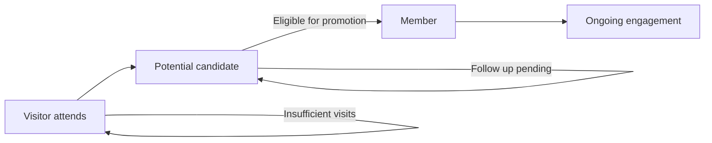

# Church Management Tracker - Central Members Management

## Purpose and Objectives
The Central Members module is the single source of truth for all people-related records across Church Management Tracker. It provides a robust, quality-focused data model for managing complete member profiles, classifying individuals by lifecycle stage, ensuring high data integrity, and powering downstream workflows in attendance, evangelism, analytics, and import/export.

Objectives:
- Maintain comprehensive, high-quality member records with auditability and consistency
- Classify individuals across visitor, potential, and member states with clear promotion rules
- Provide automatic member numbering for full members to ensure unique identification
- Detect, surface, and resolve duplicates with confidence scoring
- Offer advanced filtering, segmentation, and data quality insights
- Serve as the authoritative dataset for all dependent modules

## Target Users
- Church leadership needing accurate member rosters and health insights
- Administrative staff responsible for creating and updating member profiles
- Ministry leaders who segment and engage members by status, role, or attributes
- Data quality stewards validating records and resolving duplicates
- Import/export operators migrating and synchronizing datasets

## Key Features and Capabilities
- Comprehensive Profiles
  - Full personal information, contact details, demographics, roles, and engagement attributes
  - Commenting and history fields to keep context in record
- Advanced Classification
  - Member lifecycle types: visitor, potential, member
  - Status tracking: Regular, Irregular, Dormant
  - Promotion readiness flags and history
- Automatic Member Numbering
  - Year-scoped, sequential member_number assignment for full members
  - Uniqueness guarantees and consistent formatting
- Data Quality Scoring
  - 0–100 scoring with missing field analysis and validation flags
  - Quality dashboards highlighting gaps and review needs
- Duplicate Detection and Resolution
  - Multi-signal matching (name similarity, phone, phonetics) with confidence tiers
  - Review queues and merge workflows preserving best data
- Real-time Monitoring
  - Instant updates across users and devices
  - Quality and integrity signals surfaced to dashboards
- Advanced Filtering and Segmentation
  - Combine lifecycle status, roles, flags, quality thresholds, and text search
  - Export filtered sets to structured data formats through the Import/Export module

## Data Structures and Fields
The module tracks a normalized, quality-scored profile for each individual. Representative fields:

| Field | Type | Description | Examples |
|------|------|-------------|----------|
| id | string | System-generated document ID | `9f3a...` |
| member_number | string | Unique sequential ID for full members (year-scoped) | `M2025-001` |
| first_name | string | Given name | `Jayden` |
| surname | string | Family name; optional but recommended | `Ayeh` |
| full_name | string | Computed full name, used for sorting and display | `Jayden Ayeh` |
| display_name | string | Preferred display label in UI | `Jay A.` |
| canonical_name | string | Admin-verified canonical full name | `Jayden Ayeh` |
| name_variations | string[] | Known name variants and aliases | `["Jay", "J. Ayeh"]` |
| phone_number | string | Primary phone number (validated format) | `+44 7123 456789` |
| address | string | Mailing or residential address | `123 Church Street, London` |
| age | enum | Age bracket | `25-34yrs`, `35 yrs & over` |
| member_type | enum | Lifecycle type | `visitor`, `potential`, `member` |
| member_status | enum | Engagement status for members | `Regular`, `Irregular`, `Dormant` |
| church_role | string | Organizational or ministry role | `Elder`, `Basonta`, `No role` |
| marital_status | string | Marital status | `Married`, `Single` |
| degree | string | Highest education level | `Masters`, `Yes` |
| employed | string | Employment indicator | `Yes`, `No` |
| tithe_payer | string | Tithing indicator | `Yes`, `No` |
| baptised | string | Baptism indicator | `Yes`, `No` |
| schools | string[] | Completed ministry schools/training | `["Annual Global Exams"]` |
| data_quality.score | number | 0–100 quality score | `85` |
| data_quality.missing_fields | string[] | Fields absent but expected | `["email", "address"]` |
| data_quality.validation_flags.missing_surname | boolean | True if surname missing | `false` |
| data_quality.validation_flags.invalid_phone | boolean | True if phone format invalid | `false` |
| data_quality.validation_flags.duplicate_detected | boolean | True if duplicate suspected | `false` |
| data_quality.validation_flags.needs_review | boolean | True if record requires manual review | `true` |
| data_quality.validation_flags.incomplete_address | boolean | True if address incomplete | `false` |
| visitor_info.first_visit_date | date | First attendance date (for visitors/potential) | `2025-07-06` |
| visitor_info.last_visit_date | date | Most recent attendance date | `2025-08-24` |
| visitor_info.total_visits | number | Count of attendances captured | `6` |
| visitor_info.promotion_eligible | boolean | Eligible to promote based on rules | `true` |
| duplicate_info.master_record_id | string | If duplicate, pointer to master record | `a1b2...` |
| duplicate_info.merged_from_ids | string[] | IDs merged into this record | `["x12", "y34"]` |
| comments | {id,text,timestamp,author}[] | Free-text activity notes | `Follow-up scheduled` |
| createdAt | date | Record creation timestamp | `2025-06-10T12:00:00Z` |
| updatedAt | date | Last update timestamp | `2025-08-28T09:45:00Z` |
| createdBy | string | User ID or system source | `adminUser` |

Notes:
- Data quality fields are maintained automatically and recalculated on updates and imports.
- Member numbers are assigned to member_type member on creation or promotion.
- Visitor tracking is retained post-promotion for historical analytics.

## Workflow Processes
1) Member Onboarding
- Create new record with minimum required fields (first_name, phone_number, member_type)
- Real-time validation flags guide the user to improve completeness
- Data quality score is computed, record appears in quality dashboards if below threshold

2) Lifecycle Classification and Promotion
- Individuals can start as visitor or potential and progress toward member
- Promotion readiness is determined by visit counts and configurable rules
- On promotion to member, member_number is generated and assigned

3) Data Quality Review
- Records with needs_review appear in quality views for targeted cleanup
- Users address missing fields and resolve validation warnings
- Score increases as completeness and validations improve

4) Duplicate Detection and Merge
- Records are scanned for potential duplicates based on phone, name similarity, and phonetics
- Duplicates queue for human review; users confirm and perform field-level merge
- Merge preserves the most complete values and aggregates history and comments

5) Profile Maintenance and Engagement Updates
- Administrative edits update computed fields and re-score quality
- Engagement attributes such as tithe_payer or baptised inform analytics and segmentation

6) Segmentation and Export
- Advanced filters isolate cohorts by lifecycle, role, engagement, and quality
- Filtered sets can be exported via the Import/Export system for offline workflows

7) Audit and Monitoring
- Changes are timestamped for traceability
- Module feeds data quality and engagement indicators into the overall dashboard

## Integration Points with Other Modules
- Sunday Service Attendance
  - Attendee selection uses Central Members as the definitive directory
  - First-time visitors not matched here are captured in Sunday Service and optionally created in First Timers
  - See [docs/modules/sunday-service.md](docs/modules/sunday-service.md)
- First Timers Management
  - Promotion from first-timer to member creates a new Central Members record and removes the first-timer record
  - Visit history and inviter context can be carried forward to the new member profile
  - See [docs/modules/first-timers.md](docs/modules/first-timers.md)
- Evangelism and Contacts
  - Central members can be referenced as inviters and serve as anchors for engagement analytics
  - See [docs/modules/evangelism.md](docs/modules/evangelism.md)
- Dashboard and Analytics
  - Provides counts, quality scores, role distributions, and lifecycle breakdowns
  - See [docs/modules/dashboard-analytics.md](docs/modules/dashboard-analytics.md)
- Import/Export
  - Acts as the module of record for member imports with mapping, validation, and duplicate checks
  - Supports exporting filtered cohorts and templates for bulk onboarding
  - See [docs/modules/import-export.md](docs/modules/import-export.md)

## Benefits and Outcomes
- Single source of truth for all person records, eliminating data silos across Church Management Tracker
- Higher data integrity through validation, scoring, and duplicate management
- Faster operations via real-time updates and powerful filtering
- Clear lifecycle visibility from visitor to member, enabling targeted follow-ups
- Strong analytics foundation for engagement, growth, and quality reporting

## Related User Guides
- [Administrative Staff Workflows](../user-guides/administrative-workflows.md) - Managing member profiles and data quality procedures
- [Data Entry Personnel Workflows](../user-guides/data-entry-workflows.md) - Updating member information and status changes
- [Common Procedures](../user-guides/common-procedures.md) - Search, filtering, and basic operations

## Member Lifecycle Overview

## Related Documentation
- [Documentation Hub](../README.md) - Main documentation index for Church Management Tracker
- [Module Index](README.md) - Overview of all system modules
- [System Architecture](../overview/system-architecture.md) - Technical architecture overview
- [Application Overview](../overview/application-overview.md) - Getting started with Church Management Tracker