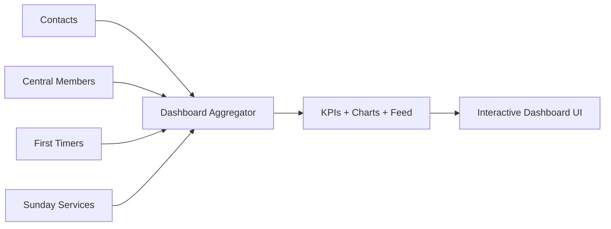
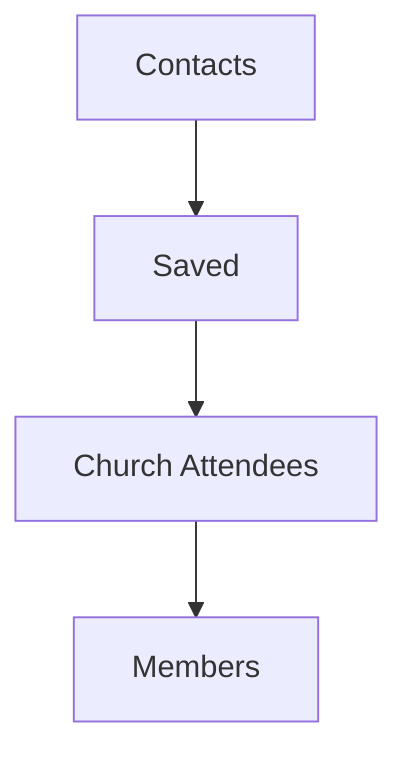

# Church Management Tracker - Dashboard and Analytics

## Purpose and Objectives
The Dashboard and Analytics module provides a unified, high-signal view of church operations within Church Management Tracker, converting raw data from all modules into actionable insights. It offers live stats, conversion funnels, growth trends, engagement scores, and an activity feed to enable timely, data-driven decisions.

Objectives:
- Aggregate cross-module data into coherent, real-time insights
- Visualize growth, conversion, attendance, and engagement trends
- Provide drillable KPIs and interactive charts bound to filters
- Surface data quality signals to improve record integrity
- Power leadership reporting with consistent metrics and comparable timelines

References:
- Architecture overview: [system-architecture.md](docs/overview/system-architecture.md)
- Application overview: [application-overview.md](docs/overview/application-overview.md)

## Target Users
- Senior leadership reviewing health and growth metrics
- Ministry leaders tracking evangelism, attendance, and follow-ups
- Administrators monitoring data quality and operational performance
- Analysts/reporters preparing updates for teams and stakeholders

## Key Features and Capabilities
- Cross-Module Statistics
  - Totals across contacts, members, first-timers, services
  - Date-range filters for monthly/quarterly/yearly snapshots
- Growth Rate Tracking
  - Month-to-date and period-over-period comparisons
  - Trend indicators for key modules
- Conversion Funnel Analysis
  - Contacts → Saved → Church Attendees → Members
  - Conversion rates and drop-off analysis
- Member Engagement Scoring
  - Regular/Irregular/Dormant distribution
  - Derived engagement score and role distributions
- Activity Feed
  - Recent events from all modules (new contacts, services, first-timers, members)
  - Time-ordered, metadata-rich entries for operational awareness
- Performance Metrics
  - System connectivity health and response time
  - Data growth, usage patterns, module access estimates
- Data Quality Overview
  - Average quality scores, records needing review, completeness %
- Interactive Charts
  - Time series, category distributions, engagement radar/bars
  - All charts react instantly to filter changes

## Data Structures and Fields
The module aggregates canonical analytics objects across modules. Representative structures:

Dashboard statistics (aggregates)
- Totals: totalContacts, totalMembers, totalFirstTimers, totalServices
- GrowthRates: contactsThisMonth, membersThisMonth, firstTimersThisMonth, servicesThisMonth
- ConversionFunnel (aggregated): high-level percentages from contact to member
- DataQuality: averageScore, recordsNeedingReview, completenessPercentage
- Engagement: activeMembers, regularAttendance, tithePayers, baptizedMembers

Activity feed
- Feed item: { id, type, action, title, description, timestamp, moduleId, moduleName, metadata, icon, iconColor }

Chart datasets
- Overview
  - timeSeriesData: labels (months) + datasets (new contacts/members, etc.)
  - categoryDistribution: labels + data + colors
  - growthMetrics: array of current vs previous counts with trend up/down
- Analytics
  - conversionFunnel: stages with counts and percentages
  - memberJourney: staged counts, average duration, drop-off indicators
  - attendanceTrends: labels + datasets of attendance
  - engagementScores: categories + scores

Filter model (applies across datasets)
- Date range: start, end
- Optional module-specific filter passthroughs (kept abstract at dashboard level)

Representative fields table:

| Group | Field | Type | Description |
|------|-------|------|-------------|
| Totals | totalContacts | number | Count of contact records in range |
| Totals | totalMembers | number | Count of central members in range |
| Totals | totalFirstTimers | number | Count of first-timer records in range |
| Totals | totalServices | number | Count of recorded services in range |
| Growth | contactsThisMonth | number | Contacts created since start of current month |
| Growth | membersThisMonth | number | Members created since start of current month |
| Funnel | stages[] | array | Ordered stages with name, count, percentage |
| Quality | averageScore | number | Average member data quality score |
| Quality | recordsNeedingReview | number | Members flagged needs_review |
| Quality | completenessPercentage | number | % of records with critical fields present |
| Engagement | activeMembers | number | Regular + Irregular |
| Engagement | tithePayers | number | Members with tithe_payer Yes |
| Activity | items[] | array | Recent events across modules |

Notes:
- All dashboard views recompute when filters are changed.
- The dashboard consumes module outputs as-is; it does not modify source data.

## Workflow Processes
1) Data Aggregation
- Pull latest data points from Contacts, Central Members, First Timers, and Sunday Services
- Apply date-range filters where relevant to ensure comparable metrics

2) KPI Computation
- Compute totals, growth rates, conversion funnel, and engagement metrics
- Derive data quality aggregates from member quality signals

3) Chart Preparation
- Generate time series for the last N periods (e.g., 6–12 months)
- Prepare distribution and funnel datasets for visualization components

4) Activity Feed Assembly
- Collect recent events from each module and normalize into a common item shape
- Sort by timestamp and display a unified feed

5) Real-Time Updates
- Subscribe to changes in upstream modules to recompute and refresh dashboard data
- Real-time updates keep the dashboard synchronized automatically

6) Export/Reporting (via Import/Export)
- Export filtered or summarized datasets for external reporting needs

## Integration Points with Other Modules
- Central Members
  - Member counts by status, roles, and data quality scoring
  - See: [central-members.md](docs/modules/central-members.md)
- Sunday Service
  - Historical attendance trends, first-timer counts per service
  - See: [sunday-service.md](docs/modules/sunday-service.md)
- Evangelism
  - Contact counts, saved flags, and attendance outcomes inform funnel
  - See: [evangelism.md](docs/modules/evangelism.md)
- First Timers
  - First-timer volume, visit trends, conversion rates
  - See: [first-timers.md](docs/modules/first-timers.md)
- Import/Export
  - Template generation for standardized reporting and data movement
  - See: [import-export.md](docs/modules/import-export.md)

## Benefits and Outcomes
- Single pane of glass for operational health and growth across Church Management Tracker
- Faster leadership decisions backed by consistent, comparable metrics
- Immediate visibility into data quality and follow-up gaps
- Clear conversion funnel highlighting where to focus ministry efforts
- Engaging, interactive charts encourage exploratory analysis

## Related User Guides
- [Leadership Analytics Guide](../user-guides/leadership-analytics.md) - Dashboard overview and cross-module analytics
- [Ministry Leader Workflows](../user-guides/ministry-leader-workflows.md) - Performance monitoring and reporting
- [Administrative Staff Workflows](../user-guides/administrative-workflows.md) - Data quality monitoring
- [Common Procedures](../user-guides/common-procedures.md) - Generating reports and exports

## High-Level Data Flow

## Conversion Funnel Overview

## Related Documentation
- [Documentation Hub](../README.md) - Main documentation index for Church Management Tracker
- [Module Index](README.md) - Overview of all system modules
- [System Architecture](../overview/system-architecture.md) - Technical architecture overview
- [Application Overview](../overview/application-overview.md) - Getting started with Church Management Tracker