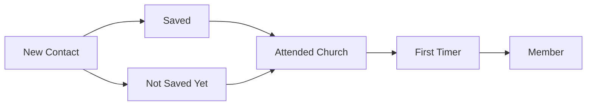

# Church Management Tracker - Evangelism and Contact Management

## Purpose and Objectives
The Evangelism module centralizes outreach contact tracking and follow-up workflows within Church Management Tracker. It captures who was contacted, key spiritual indicators, inviter attribution, and notes, then surfaces insights through filters and visual analytics. Its goal is to support consistent follow-up, measure outreach effectiveness, and improve conversion outcomes.

Objectives:
- Record and organize all outreach contacts in a structured, searchable list
- Track spiritual progression markers and church engagement readiness
- Attribute invitations to members and monitor inviter impact
- Maintain a comment history that preserves context and follow-up actions
- Provide distribution and trend analytics to guide outreach strategies

## Target Users
- Evangelism leads coordinating outreach and follow-up teams
- Volunteers and data-entry personnel entering contact records and updates
- Pastors and ministry leaders reviewing evangelism effectiveness metrics
- Administrators auditing contact data quality and coverage

## Key Features and Capabilities
- Contact Categorization
  - Standard categories such as responsive, non-responsive, has church, events only, etc.
  - Clear color- and label-driven interface taxonomy for quick scanning
- Salvation Status Tracking
  - Saved boolean flag to indicate professions of faith and spiritual milestones
- Church Attendance Monitoring
  - attendedChurch flag to indicate attendance following contact
- Probability Assessment
  - likelyToCome indicator to capture readiness signal for future attendance
- Inviter Tracking
  - invitedBy and invitedById fields link contacts to inviters (sourced from Central Members)
- Comment System
  - Structured comment list with timestamp, author metadata, and history retention
- Visual Analytics
  - Category distributions, saved and attendance ratios, and trends over time
- Filtering and Search
  - Filter by category, inviter, saved, attendedChurch, likelyToCome, and date range
  - Lightweight text search for name/phone/inviter

## Data Structures and Fields
Representative fields captured for each contact:

| Field | Type | Description | Examples |
|------|------|-------------|----------|
| id | string | System-generated document ID | `ct_9f3a...` |
| name | string | Full name of the contact | `John Doe` |
| phone | string | Contact phone number | `+44 7123 456789` |
| date | date | Contact date (outreach interaction date) | `2025-08-14` |
| category | enum | Engagement category | `responsive`, `non-responsive`, `has church`, `events only` |
| invitedBy | string | Display name of inviter | `Mary Johnson` |
| invitedById | string | Central Members reference ID for inviter | `mbr_a12...` |
| saved | boolean | Salvation decision indicator | `true` |
| attendedChurch | boolean | Attended church after contact | `false` |
| likelyToCome | boolean | Likely to attend in near future | `true` |
| comments | {id,text,timestamp,authorId?,authorName?}[] | Ordered history of notes | `[{ text: "Prayed for salvation" }]` |
| createdAt | date | Creation timestamp | `2025-08-14T10:00:00Z` |
| updatedAt | date | Last update timestamp | `2025-08-15T09:00:00Z` |

Notes:
- Inviter lists are built from Central Members for reliable attribution.
- Comments retain legacy notes when migrated, ensuring no context is lost.

## Workflow Processes
1) Add or Import Contact
- Create new contact with name, phone, date, and category
- Optional: map inviter to a Central Member for attribution

2) Update Spiritual Indicators
- Mark saved when a decision is recorded
- Toggle attendedChurch based on subsequent attendance
- Set likelyToCome for near-term follow-up targeting

3) Record Follow-Up Notes
- Add comments with time-stamped entries to track engagements and next steps
- Maintain a clear audit trail of interactions

4) Filter and Analyze
- Use filters to focus on specific categories, inviters, or time windows
- Review distributions and trends to evaluate outreach impact

5) Conversion and Handover
- Contacts who begin attending can appear in conversion analyses
- As they become first-timers and eventually members, downstream modules reflect progression

## Integration Points with Other Modules
- Central Members
  - Inviter dropdowns reference Central Members to standardize attribution
  - Supports member engagement analytics tied to evangelism activity
  - See [docs/modules/central-members.md](docs/modules/central-members.md)
- Sunday Service
  - Attendance outcomes (attendedChurch) inform conversion analysis
  - See [docs/modules/sunday-service.md](docs/modules/sunday-service.md)
- First Timers
  - Contacts who attend services may appear as first-timers for structured follow-up
  - See [docs/modules/first-timers.md](docs/modules/first-timers.md)
- Dashboard & Analytics
  - Contributes to conversion funnel (contacts → saved → church attendance → members)
  - Supplies activity feed items and performance indicators
  - See [docs/modules/dashboard-analytics.md](docs/modules/dashboard-analytics.md)
- Import/Export
  - Supports bulk ingestion of outreach lists and export of filtered segments
  - See [docs/modules/import-export.md](docs/modules/import-export.md)

## Benefits and Outcomes
- Standardized outreach data that is searchable, filterable, and analyzable within Church Management Tracker
- Clear visibility into spiritual progression and follow-up readiness
- Strong linkage between inviters and outcomes for coaching and recognition
- Actionable distributions and trends to optimize evangelism strategies
- Clean handoff to First Timers and Central Members modules as contacts progress

## Related User Guides
- [Ministry Leader Workflows](../user-guides/ministry-leader-workflows.md) - Evangelism contact management and follow-up tracking
- [Data Entry Personnel Workflows](../user-guides/data-entry-workflows.md) - Adding new contacts from evangelism efforts
- [Common Procedures](../user-guides/common-procedures.md) - Search, filtering, and basic operations

## Evangelism Outcomes Overview

## Related Documentation
- [Documentation Hub](../README.md) - Main documentation index for Church Management Tracker
- [Module Index](README.md) - Overview of all system modules
- [System Architecture](../overview/system-architecture.md) - Technical architecture overview
- [Application Overview](../overview/application-overview.md) - Getting started with Church Management Tracker