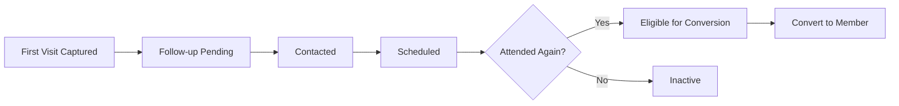

# Church Management Tracker - First Timers Management

## Purpose and Objectives
The First Timers module provides a dedicated pipeline to identify, track, and nurture new visitors toward steady participation and full membership within Church Management Tracker. It ensures every new attendee is captured, followed up, and progressed through a clear, auditable workflow with eligibility rules and bulk conversion tools.

Objectives:
- Automatically capture new visitors from Sunday Service attendance
- Maintain a simple yet complete record for efficient follow-up
- Track visit counts and follow-up status with clear eligibility logic
- Enable single and bulk conversion to full Central Members
- Provide soft delete and restore to protect data integrity
- Integrate with analytics to report conversion and trend metrics

References:
- Workflow Plan: [`my-tracker-app/first-timer-workflow-plan.md`](my-tracker-app/first-timer-workflow-plan.md)

## Target Users
- Follow-up and integration teams managing visitor journeys
- Evangelism and pastoral leaders tracking conversion progress
- Data-entry staff capturing visitor information and notes
- Administrators auditing conversions and restoring records if needed

## Key Features and Capabilities
- Automatic Creation
  - New first-timers are created from Sunday Service when attendee names are not matched in Central Members
  - Returning first-timers are detected and their visitCount is incremented
- Visit Count Tracking
  - firstServiceDate and lastServiceDate maintained with each attendance
  - visitCount used to determine conversion eligibility
- Follow-up Status Management
  - Standard statuses: Pending, Contacted, Scheduled, Converted, Inactive
  - Quick filtering and reporting by follow-up state
- Conversion Eligibility Rules
  - Returning first-timers flagged for promotion after multiple visits
  - Conversion interface pre-fills available visitor data for smooth onboarding
- Bulk Conversion
  - Convert multiple eligible first-timers in one operation for efficiency
- Soft Delete with Restore
  - Records can be marked deleted and later restored with metadata retained
- Sunday Service Integration
  - Tight link to attendance records creates/update first-timer entries directly from services

## Data Structures and Fields
Representative fields per first-timer:

| Field | Type | Description | Examples |
|------|------|-------------|----------|
| id | string | System-generated document ID | `ft_9f3a...` |
| name | string | Full name of the visitor | `Sarah Johnson` |
| firstServiceDate | date | First service attended | `2025-08-10` |
| lastServiceDate | date | Most recent service attended | `2025-08-24` |
| visitCount | number | Total recorded attendances | `2` |
| followUpStatus | enum | Follow-up status | `Pending`, `Contacted`, `Scheduled`, `Converted`, `Inactive` |
| phone | string | Contact number (optional) | `+44 7123 456789` |
| email | string | Contact email (optional) | `sarah@example.com` |
| address | string | Address (optional) | `123 Church Street` |
| gender | string | Gender (optional) | `Female` |
| ageGroup | string | Age bracket (optional) | `25-34yrs` |
| schools | string[] | Training or school context (optional) | `[]` |
| invitedBy | string | Display name of inviter (optional) | `John Doe` |
| invitedById | string | Central Members id of inviter (optional) | `mbr_a12...` |
| notes | string | Free-text note for follow-up | `Warm engagement, wants to join a group` |
| deleted | boolean | Soft delete flag | `false` |
| createdAt | date | Creation timestamp | `2025-08-10T12:00:00Z` |
| updatedAt | date | Last update timestamp | `2025-08-24T09:30:00Z` |
| source | string | Origin (Manual Entry, Sunday Service) | `Sunday Service` |

Notes:
- visitCount and lastServiceDate advance when a returning first-timer attends subsequent services.
- Deleted records remain recoverable via restore tooling until permanently removed.

## Workflow Processes
1) Automatic Capture from Sunday Service
- When attendance is saved, unmatched names are created as new first-timers (visitCount = 1)
- If an existing first-timer with the same name is found, visitCount increments and lastServiceDate updates

2) Follow-up Tracking
- Teams update followUpStatus as engagement progresses: Pending → Contacted → Scheduled → Converted or Inactive
- Notes capture conversation context and next steps

3) Conversion Eligibility
- Returning first-timers (visitCount > 1) are shown as promotion-eligible
- Individual conversion launches a prefilled member interface for validation and completion

4) Bulk Conversion
- Select multiple eligible first-timers and perform a single bulk conversion action
- System creates corresponding Central Members and removes converted first-timers

5) Soft Delete and Restore
- Mark incorrect or merged records as deleted; they are excluded from standard views
- Restore deleted entries if needed, with metadata preserved

6) Data Review and Analytics
- Use filters to identify Pending or Scheduled follow-ups
- Review monthly trends and conversion counts on the Dashboard

## Integration Points with Other Modules
- Sunday Service
  - Creates or updates first-timer records based on attendee input
  - visitCount and lastServiceDate synchronized with service dates
  - See: [`docs/modules/sunday-service.md`](docs/modules/sunday-service.md)
- Central Members
  - Conversion creates a full member record and removes the first-timer record
  - Selected visitor fields flow into the new member profile (name, contact, address, visit history)
  - See: [`docs/modules/central-members.md`](docs/modules/central-members.md)
- Dashboard & Analytics
  - Provides first-timer counts, conversion rates, and monthly trends
  - See: [`docs/modules/dashboard-analytics.md`](docs/modules/dashboard-analytics.md)
- Import/Export
  - Supports bulk import of first-timers (e.g., event visitors) and export of filtered lists
  - See: [`docs/modules/import-export.md`](docs/modules/import-export.md)

## Benefits and Outcomes
- Guarantees that first-time visitors are never missed in Church Management Tracker attendance workflows
- Clear, auditable pipeline from first visit to membership readiness
- Efficient, scalable conversion through single or bulk operations
- Actionable visibility for follow-up prioritization and team coordination
- Credible analytics for conversion trends and outreach effectiveness

## Related User Guides
- [Ministry Leader Workflows](../user-guides/ministry-leader-workflows.md) - First-timer identification and nurturing processes
- [Administrative Staff Workflows](../user-guides/administrative-workflows.md) - Processing new member registrations and conversions
- [Data Entry Personnel Workflows](../user-guides/data-entry-workflows.md) - Processing first-timer information
- [Common Procedures](../user-guides/common-procedures.md) - Search, filtering, and basic operations

## First-Timer Journey Overview

## Related Documentation
- [Documentation Hub](../README.md) - Main documentation index for Church Management Tracker
- [Module Index](README.md) - Overview of all system modules
- [System Architecture](../overview/system-architecture.md) - Technical architecture overview
- [Application Overview](../overview/application-overview.md) - Getting started with Church Management Tracker