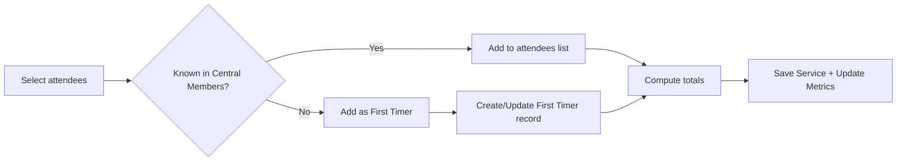

# Church Management Tracker - Sunday Service Attendance

## Purpose and Objectives
The Sunday Service module captures, structures, and analyzes weekly service attendance and related ministry metrics within Church Management Tracker. It standardizes how attendees are recorded, automates first‑time visitor detection, and produces clear breakdowns and trends that power follow‑up and decision making.

Objectives:
- Provide an efficient, low-friction workflow to record attendees during or after a service
- Automatically identify first-time visitors and create trackable records for follow-up
- Maintain consistent, comparable service metrics across dates and locations
- Surface historical trends and insights used by leadership and ministry teams
- Feed accurate data to dashboards and downstream analytics

## Target Users
- Ushers and service administrators inputting or updating attendance
- Pastoral and ministry leadership reviewing weekly activity and trends
- Follow-up coordinators identifying first-timers and conversions
- Data-entry staff ensuring accuracy and completeness of records

## Key Features and Capabilities
- Service Creation and Editing
  - Create service entries with date, topic, location, notes, and image uploads
  - Edit existing services with full auditability of key metrics
- Enhanced Attendee Manager
  - Persistent selection interface with search, bulk select/clear, and live counts
  - Select from Central Members directory and add new attendees as first-timers
  - Clear visualization of selections organized by category
- Automatic First‑Timer Detection
  - Unrecognized names captured as first-timers with visit counts
  - Returning first-timers increment visitCount and are flagged as conversion‑eligible
- Attendance Breakdown and Derived Metrics
  - Total attendance, member vs first‑timer counts, adults/children subtotals
  - Converts and tithers tracking for service-level KPIs
- Image Upload Support
  - Attach service photos; links are stored for review and dashboards
- Historical Analytics
  - Filter by date range or topic to review trend lines and week-over-week comparisons
  - Feeds Dashboard module with attendance trends and summary statistics

References:
- Specification: [my-tracker-app/sunday-service-attendance-enhancement-spec.md](my-tracker-app/sunday-service-attendance-enhancement-spec.md)
- User Guide: [my-tracker-app/sunday-service-attendance-user-guide.md](my-tracker-app/sunday-service-attendance-user-guide.md)

## Data Structures and Fields
Representative data captured per service:

| Field | Type | Description | Examples |
|------|------|-------------|----------|
| id | string | System-generated document ID | `svc_abc123` |
| service_date | date | Calendar date of the service | `2025-08-24` |
| topic | string | Sermon or theme title | `Faith That Works` |
| location | string | Venue or campus | `Main Auditorium` |
| notes | string | Free-text notes for context | `Family & Friends Sunday` |
| attendance_adults | number | Adult headcount (optional) | `120` |
| attendance_children | number | Children headcount (optional) | `25` |
| attendance_first_timers | number | Derived count of first-timers for this service | `5` |
| converts | number | Count of recorded converts for this service | `2` |
| tithers | number | Count of recorded tithers for this service | `40` |
| attendees | string[] | Selected Central Members’ full names | `["John Anderson", "Mary Baker"]` |
| first_timers | { name, added_at?, added_by? }[] | First-time visitor entries captured at service | `[{ name: "Sarah Johnson" }]` |
| total_attendance | number | Derived total (members + first_timers) | `145` |
| attendance_breakdown | { members: number; first_timers: number } | Split of totals | `{ members: 140, first_timers: 5 }` |
| service_image_refs | string[] | References to uploaded images | `["image1.jpg"]` |
| created_at | date | Record creation timestamp | `2025-08-24T12:30:00Z` |
| updated_at | date | Last update timestamp | `2025-08-24T13:00:00Z` |

Notes:
- total_attendance and attendance_breakdown are derived from selections (Central Members and first-timers).
- first_timers records can be persisted in the First Timers module for follow-up.

## Workflow Processes
1) Create Service
- Enter service_date, topic, location, optional notes
- Optionally upload images for archival and visual reports

2) Select Attendees
- Open Enhanced Attendee Manager
  - Search and check from Central Members directory
  - Add new attendees as first-timers (name only initially)
  - Use Select All/Clear All and live counts to speed entry
- The interface displays organized selections for both members and first-timers

3) Save Service
- On save, totals and breakdown are computed
- For new first-timers:
  - A record is created in First Timers with visitCount = 1
- For returning first-timers:
  - The First Timers entry is updated with lastServiceDate and visitCount++

4) Edit Service
- Modify attendee lists or metrics; derived totals refresh accordingly
- Any newly added first-timers are created; existing ones are not duplicated

5) Review History and Trends
- Use filters to view a time series of attendance metrics
- Export data if needed via Import/Export for external reporting

## Integration Points with Other Modules
- Central Members
  - Attendee selection draws from Central Members directory
  - Supports consistent naming and avoids duplicates at source
  - See [docs/modules/central-members.md](docs/modules/central-members.md)
- First Timers
  - Automatically creates or updates first-timer records based on attendee input
  - visitCount drives conversion eligibility signals for follow-up
  - See [docs/modules/first-timers.md](docs/modules/first-timers.md)
- Dashboard & Analytics
  - Supplies attendance trends, first-timer counts, and related KPIs for visualization
  - See [docs/modules/dashboard-analytics.md](docs/modules/dashboard-analytics.md)
- Import/Export
  - Historical services can be exported for analysis; imports support bulk backfills
  - See [docs/modules/import-export.md](docs/modules/import-export.md)

## Benefits and Outcomes
- Faster, more accurate attendance capture with intuitive selection controls in Church Management Tracker
- Automatic identification of first-time visitors ensures no follow-up is missed
- Clean, comparable metrics across services enable week-over-week tracking
- Rich integrations ensure a seamless flow from attendance to follow-up to analytics
- Image archiving supports communication, promotion, and historical context

## Related User Guides
- [Data Entry Personnel Workflows](../user-guides/data-entry-workflows.md) - Recording Sunday service attendance procedures
- [Ministry Leader Workflows](../user-guides/ministry-leader-workflows.md) - Sunday service attendance analysis
- [Common Procedures](../user-guides/common-procedures.md) - Search, filtering, and basic operations

## Attendee Processing Overview

## Related Documentation
- [Documentation Hub](../README.md) - Main documentation index for Church Management Tracker
- [Module Index](README.md) - Overview of all system modules
- [System Architecture](../overview/system-architecture.md) - Technical architecture overview
- [Application Overview](../overview/application-overview.md) - Getting started with Church Management Tracker