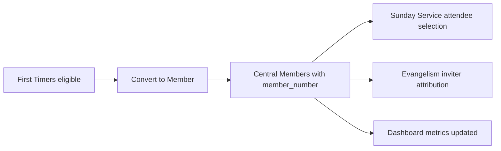

# Church Management Tracker - Administrative Staff Workflows

Target role: Administrative Staff — church administrators responsible for managing people records, data quality, imports and exports, and account hygiene within Church Management Tracker.

Responsibilities
- Maintain central member profiles as the single source of truth
- Enforce data quality standards and resolve duplicates
- Process new registrations and conversions from first timers to members
- Operate import and export workflows for bulk data movement
- Coordinate with leadership and ministry teams to keep records current

## Related Modules
- [Central Members](../modules/central-members.md) - Member profiles and data quality management
- [First Timers](../modules/first-timers.md) - Visitor conversion workflows
- [Sunday Service](../modules/sunday-service.md) - Attendance tracking integration
- [Evangelism](../modules/evangelism.md) - Contact management workflows
- [Dashboard and Analytics](../modules/dashboard-analytics.md) - Quality monitoring and metrics
- [Import and Export](../modules/import-export.md) - Bulk data movement procedures

Screenshot: Central Members — Data Quality dashboard

1. Managing central member profiles and data quality

Goal: keep a complete, consistent record for every person within Church Management Tracker with strong data quality and no duplicates.

Procedure
1. Navigate to Central Members.
2. Use filters to find records with needs_review or low data_quality.score.
3. Open a profile and complete missing critical fields first name, phone number, member_type.
4. Address validation flags invalid phone, missing surname, incomplete address.
5. Save to recompute data_quality.score and clear warnings.
6. Add comments to capture context and follow up items.
7. Repeat across records prioritized by the quality dashboard.

Pro tips
- Use advanced filtering to combine lifecycle status, roles, and quality thresholds.
- Export a filtered cohort to structured data formats to share cleanup assignments with teams, then re-import updates if needed.
- Maintain canonical_name and name_variations for consistent search results.

Common pitfalls and how to avoid them
- Inconsistent phone formats: apply a single national format during edits and imports to aid de duplication.
- Overwriting history: preserve comments and audit fields when merging or importing.
- Skipping required fields: validation flags should be zero before you consider the record clean.

Success metrics
- Average data_quality.score > 85
- Records with needs_review reduced to near zero
- Duplicate flag rate trending down week over week

Integration points
- Sunday Service attendee picker relies on Central Members naming consistency.
- Evangelism inviters resolve against Central Members to attribute outcomes.
- Dashboard quality indicators aggregate Central Members scores.

2. Processing new member registrations and conversions

Goal: convert eligible first timers into full members with unique member_number assignment.

Procedure — single conversion
1. Open First Timers.
2. Filter for visitCount greater than 1 or eligibility flagged.
3. Select a first timer and choose Convert to Member.
4. Review prefilled fields, complete required member attributes, and confirm member_type member.
5. On save, a new Central Members record is created and member_number is assigned automatically.
6. Verify that the first timer record is removed or marked converted and visit history is retained.

Procedure — bulk conversion
1. In First Timers, multi select eligible visitors.
2. Trigger Bulk Convert and review the preview list.
3. Confirm to create members in batch and assign numbers.
4. Review the summary for any exceptions to fix individually.

Pro tips
- Keep inviter fields invitedBy invitedById to preserve attribution for analytics.
- Maintain address and contact fields to avoid low data quality on new members.

Common pitfalls and how to avoid them
- Creating duplicates by manual add after conversion: always use the Convert action rather than creating a fresh member.
- Losing visit history: ensure conversion tooling is used so first timer visit history is carried over.

Success metrics
- Conversion cycle time less than 7 days from first eligibility
- Zero duplicate creation during conversion

Integration points
- Conversion triggers Central Members creation and Dashboard updates.
- Sunday Service visitCount changes drive eligibility signals in First Timers.

Screenshot: First Timers — Conversion modal

3. Data import and export procedures

Goal: move data in and out safely with validation, duplicate handling, and full auditability.

Import workflow
1. Open Import and Export and launch Universal Import Wizard.
2. Choose the target module for example central members, first timers, sunday services, contacts.
3. Upload structured data and map columns to module fields using suggested mappings.
4. Run Validate only to generate a quality report and fix issues in source if needed.
5. Start Import with batch processing and monitor progress counters.
6. Review the summary including successes, failures, and duplicates detected or skipped.

Export workflow
1. Open Universal Export.
2. Choose the source module and optional fields to include.
3. Generate the file in structured data formats.
4. Download and share with stakeholders or archive for backup.

Pro tips
- Use skipDuplicates when onboarding external lists that might overlap existing data.
- Save and reuse mapping templates for recurring imports.
- Keep a naming convention for exported files including date and module for traceability.

Common pitfalls and how to avoid them
- Header mismatches: confirm mapping for similarly named columns like surname vs last_name.
- Mixed date formats: standardize to ISO dates before import where possible.
- Updating existing records inadvertently: only enable updateExisting when you have explicit match rules defined.

Success metrics
- Import failure rate under 2 percent
- Duplicates detected and skipped tracked each run with downward trend
- Completed imports with clear summaries stored in your admin log

Related documentation
- Import and Export: [docs/modules/import-export.md](docs/modules/import-export.md)

Screenshot: Import and Export — Universal Import Wizard mapping screen

4. Maintaining data integrity and resolving duplicates

Goal: identify likely duplicates, merge with confidence, and preserve audit history.

Procedure
1. Open Duplicate Management.
2. Review the duplicates queue ordered by confidence score.
3. Open a candidate pair to compare field by field including comments and visit history.
4. Choose a master record and select best values to keep for each field.
5. Merge to preserve the master id, aggregate histories, and mark merged_from_ids.
6. Recheck the member data quality score and clear any remaining flags.

Pro tips
- Normalize phone numbers before review to improve match confidence and future detection.
- Use canonical_name to fix spelling and align variants across records.

Common pitfalls and how to avoid them
- Merging the wrong direction: always confirm master record before merge to preserve member_number and history.
- Losing context: ensure comments and visit history are included in merge results.

Success metrics
- Duplicate queue age median under 3 days
- Zero data loss after merges as confirmed by random audits

Related documentation
- Central Members duplicate policies: [docs/modules/central-members.md](docs/modules/central-members.md)

Screenshot: Duplicate Management — Merge review dialog

5. User account management

Note: deployments may provide a Users screen within the app or delegate to the authentication provider.

Common procedures
1. Create a new user and assign a role Admin, Ministry Leader, Data Entry based on least privilege.
2. Disable or archive accounts for departed staff to maintain security hygiene.
3. Reset passwords via the auth provider when users are locked out.
4. Review recent activity logs and access reports monthly.

Pro tips
- Apply role based access to restrict write operations to trained personnel.
- Use service accounts for automated imports and keep credentials rotated.

Common pitfalls and how to avoid them
- Sharing accounts between staff: always provision named accounts for traceability.
- Over privileged roles: audit permissions quarterly.

Success metrics
- Zero shared accounts
- 100 percent deprovisioning within 24 hours of staff departure

6. Quick reference metrics for admins
- Average member data quality score
- Members needing review
- Duplicate queue size and age
- First timers conversion throughput
- Import failure rates by module

Mermaid overview

## Related Documentation
- [Documentation Hub](../README.md) - Main documentation index for Church Management Tracker
- [User Guide Index](README.md) - Overview of all user workflows
- [Common Procedures](common-procedures.md) - Foundational workflows used across Church Management Tracker
- [Quick Reference Guide](quick-reference.md) - Fast lookup for terms, tips, and FAQs