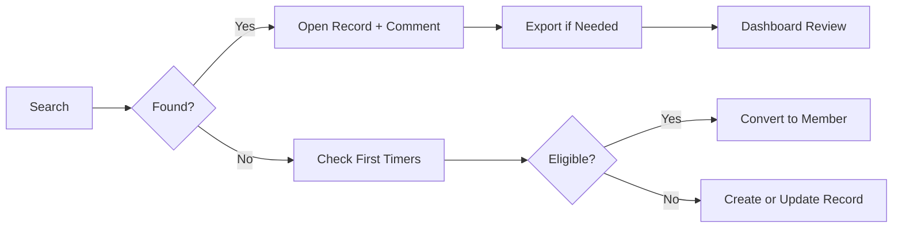

# Church Management Tracker - Common Procedures

Target users: All roles — leadership, administrative staff, ministry leaders, and data entry personnel. This guide covers foundational workflows used across Church Management Tracker modules.

Responsibilities covered
- Navigate the system efficiently and understand core concepts
- Search, filter, and segment data across modules
- Add comments and notes to preserve context and handoffs
- Generate reports and exports for sharing and analysis
- Troubleshoot common issues and keep data healthy

## Related Modules
- [Application Overview](../overview/application-overview.md) - Getting started with Church Management Tracker
- [Central Members](../modules/central-members.md) - Member directory and data quality management
- [Evangelism](../modules/evangelism.md) - Contact tracking and follow-up workflows
- [First Timers](../modules/first-timers.md) - Visitor identification and conversion processes
- [Sunday Service](../modules/sunday-service.md) - Attendance recording and analysis
- [Dashboard and Analytics](../modules/dashboard-analytics.md) - Cross-module KPIs and reporting
- [Import and Export](../modules/import-export.md) - Bulk data movement and templates

Screenshot: Global Navigation — Sidebar and top-level tabs

1. System navigation and basic concepts

Goal: move between Church Management Tracker modules quickly and understand shared UI patterns.

Concepts
- Global Navigation: sidebar or header exposes modules Dashboard, Central Members, Evangelism, First Timers, Sunday Service, Import/Export.
- Filters and Search: consistent filtering controls appear near lists in each module.
- Detail Panels and Modals: editing and conversions open in modals to keep context.
- Activity and Comments: records retain time-stamped notes for auditability and handoffs.

Procedure
1. Use the sidebar to switch modules.
2. Within each module, locate the primary list or dashboard view.
3. Use breadcrumb or back controls to return to the list after editing.
4. Check the page header for date range and global filter controls where available.

Pro tips
- Keep one browser tab per module when working in parallel to avoid losing context.
- Learn each module’s quick actions area for faster access to recurring tasks.

Common pitfalls and how to avoid them
- Opening too many nested modals: finish or cancel current edits before opening another.
- Losing unsaved changes: look for Save or Confirm buttons before navigating away.

Success metrics
- Reduced time to complete top recurring tasks onboarding, contact update, service entry
- Fewer abandoned edits or duplicate entries

Screenshot: Module — List view with filters and quick actions

2. Search and filtering across modules

Goal: isolate cohorts rapidly using consistent filters and search.

Procedure
1. Open a module list Central Members, Evangelism, First Timers, Sunday Service.
2. Use the filter bar to set criteria for example lifecycle status, category, inviter, date range.
3. Combine filters with free-text search for name or phone where supported.
4. Apply filters and review result counts shown near the list or in the header.
5. Clear filters or adjust to refine; note the combination you use frequently.

Examples
- Central Members: member_type member AND member_status Irregular AND data_quality.score < 80
- Evangelism: category responsive AND likelyToCome true AND date last 14 days
- First Timers: followUpStatus Pending AND visitCount = 1
- Sunday Service: date range last month; compare attendance trends

Pro tips
- Start broad, then narrow; avoid over-filtering which can hide relevant records.
- Use date ranges consistently when comparing datasets or preparing reports.

Common pitfalls and how to avoid them
- Conflicting filters that produce empty results: remove one criterion at a time to diagnose.
- Forgetting to reset filters: clear all before starting a new investigation.

Success metrics
- Faster cohort discovery time < 30 seconds for common segments
- Reusable filter patterns adopted by teams

Integration points
- Export filtered records via Universal Export for assignments or sharing.
- Dashboard filters align time windows with module-level analyses.

Screenshot: Filter bar — Combined filters with result summary

3. Adding comments and notes

Goal: maintain a clear, auditable history of interactions and next steps.

Procedure
1. Open a record Central Member, Contact (Evangelism), First Timer, or Service.
2. Locate the Comments or Notes panel.
3. Add a concise note including action, outcome, and next step for example called, left voicemail, try again Friday.
4. Save to timestamp the entry with your user identity.

Pro tips
- Start notes with an action verb and end with the next step to improve handoffs.
- Include ownership for example assigned to Sarah for accountability.

Common pitfalls and how to avoid them
- Long paragraphs: keep notes short and scannable; one action per note is best.
- Missing context: reference dates, people, and outcomes clearly.

Success metrics
- Percentage of active records contacts or first timers with a comment in the last 30 days
- Reduced duplication of effort due to clear handoffs

Integration points
- Comments feed into the Dashboard activity stream when enabled.
- Merged records aggregate comment histories to preserve context.

Screenshot: Record detail — Comments panel with recent entries

4. Generating reports and exports

Goal: extract data for communication, planning, and external analysis.

Procedure — exports
1. Open Import and Export.
2. Choose Universal Export.
3. Select a source module and optional subset of fields.
4. Apply the same filters used in the originating module when you created the cohort.
5. Choose a format from available structured data formats and generate the file.
6. Download and share with stakeholders or import into spreadsheets/BI tools.

Procedure — in-app dashboards
1. Open Dashboard.
2. Set date range for the reporting period.
3. Review KPIs totals, growth, funnel, engagement, quality.
4. Capture screenshots of charts or export underlying data when available.

Pro tips
- Add a naming convention to exported files module, cohort, YYYY-MM-DD.
- Keep a monthly folder for leadership packages to enable trend comparisons.

Common pitfalls and how to avoid them
- Mixing time windows across datasets: align date ranges before comparing.
- Field mismatches: document fields included in recurring exports for consistency.

Success metrics
- Report preparation time reduced month over month
- Repeated use of a standard leadership KPI pack

Integration points
- Dashboard consumes the same source data; ensure filters match your export window.
- Module exports can be re-imported after cleanup using mapping templates.

Screenshot: Import and Export — Universal Export configuration

5. Troubleshooting common issues

Goal: quickly resolve frequent problems without escalating.

Issue — cannot find a person in Central Members
- Try alternate spellings and search by phone number.
- Check First Timers in case the person has not been converted yet.
- If still missing, add as a first-timer during Sunday Service or create a central member with minimum required fields.

Issue — duplicate suspected
- Use Duplicate Management or contact an admin to queue a review.
- Avoid manual merges; use the merge workflow to preserve history and member_number.

Issue — import validation errors
- Run Validate only to view the quality report.
- Fix the source file for headers, required fields, and date formats, then re-run.
- Use skipDuplicates if lists contain overlaps.

Issue — poor data quality scores
- Complete critical fields and fix validation flags invalid phone, missing surname, incomplete address.
- Standardize phone formats and addresses during edits and imports.

Issue — inconsistent attendance totals
- Re-open the service and confirm attendee selections; ensure Save Service was clicked.
- Reconcile with usher or headcount notes; attach an explanatory comment.

Pro tips
- Keep a lightweight runbook of your team’s top-10 recurring fixes.
- When in doubt, add a comment to the record with findings for future reference.

Success metrics
- Reduced average time to resolve common issues
- Decline in repeated issues month over month

Mermaid overview

## Related Documentation
- [Documentation Hub](../README.md) - Main documentation index for Church Management Tracker
- [User Guide Index](README.md) - Overview of all user workflows
- [Quick Reference Guide](quick-reference.md) - Fast lookup for terms, tips, and system requirements
- [Application Overview](../overview/application-overview.md) - Getting started with Church Management Tracker