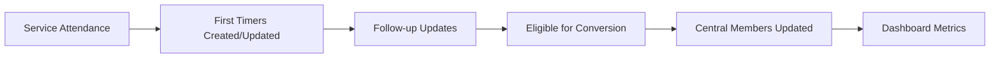

# Church Management Tracker - Data Entry Personnel Workflows

Target role: Data Entry Personnel — staff or volunteers responsible for timely and accurate recording of attendance, contacts, first-timer details, and profile updates within Church Management Tracker.

Responsibilities
- Record Sunday service attendance accurately and on time
- Add new evangelism contacts and keep indicators current
- Update member information and status changes based on verified inputs
- Capture and maintain first-timer information for follow-up teams
- Perform basic data quality checks and flag issues for admins

## Related Modules
- [Sunday Service](../modules/sunday-service.md) - Attendance recording workflows
- [Evangelism and Contacts](../modules/evangelism.md) - Contact management and updates
- [First Timers](../modules/first-timers.md) - Visitor information processing
- [Central Members](../modules/central-members.md) - Member profile management
- [Import and Export](../modules/import-export.md) - Quality control procedures
- [Dashboard and Analytics](../modules/dashboard-analytics.md) - Data quality monitoring

Screenshot: Sunday Service — Enhanced Attendee Manager

1. Recording Sunday service attendance

Goal: capture attendees and visitors for each service within Church Management Tracker with correct totals and first-timer detection.

Procedure
1. Navigate to Sunday Service and click New Service or open the service for today.
2. Enter service_date, topic, and location; add notes or images if available.
3. Open Enhanced Attendee Manager.
4. Search and select attendees from Central Members; use Select All or Clear All when relevant.
5. For people not in Central Members, add as first-timers (name only initially).
6. Save the service; totals and attendance_breakdown will compute automatically.
7. Confirm first_timers were created or updated in the First Timers module.

Pro tips
- Enter names consistently using full name to improve matching across modules.
- Add service images for context in later reports.

Common pitfalls and how to avoid them
- Forgetting to Save: always click Save Service after making selections to compute totals.
- Misspelled names: prefer Central Members selection where possible to avoid duplicates.

Success metrics
- Service entries finalized within 48 hours
- First-timer capture rate aligns with reported visitors

Integration points
- Creates/updates First Timers and feeds the Dashboard attendance trends.

Screenshot: Sunday Service — Save confirmation and totals

2. Adding new contacts from evangelism efforts

Goal: quickly register outreach contacts with enough detail for follow-up teams to work.

Procedure — add a contact
1. Navigate to Evangelism.
2. Click Add Contact and fill name, phone, date, and category for example responsive.
3. If known, set invitedBy by choosing a Central Member; add saved, attendedChurch, likelyToCome where applicable.
4. Save the contact.

Procedure — update indicators
1. When outcomes change, open the contact.
2. Toggle saved or attendedChurch as appropriate and add a brief comment to record the context.

Pro tips
- Capture at least one reliable contact field phone or email to enable follow-up.
- Use likelyToCome to highlight contacts for near-term outreach.

Common pitfalls and how to avoid them
- Missing inviter attribution: search Central Members to select invitedBy for better analytics.
- Stale indicators: update saved and attendedChurch promptly after events.

Success metrics
- 100 percent of new contacts include a phone number or alternative contact method
- Follow-up comment added within 72 hours of contact creation

Integration points
- Inviter attribution ties outcomes back to Central Members; dashboard funnels reflect conversion progress.

Screenshot: Evangelism — Add Contact form

3. Updating member information and status changes

Goal: keep member profiles current and improve data quality scoring.

Procedure — edit a profile
1. Go to Central Members and locate the person via search or filters for needs_review.
2. Open the profile and complete missing fields for example address, surname, canonical_name.
3. Validate phone format and clear any validation flags visible on the profile.
4. Save to update data_quality.score and resolve warnings.

Procedure — status updates
1. For lifecycle or engagement changes for example member_status Regular to Irregular update the relevant field.
2. Add a short comment to record reason or context.

Pro tips
- Use consistent capitalization and formatting to improve searchability.
- Update display_name only when a preferred short form is needed; keep canonical_name accurate and complete.

Common pitfalls and how to avoid them
- Editing without context: check comments and history before making significant changes.
- Skipping required fields: resolve validation flags so the record leaves needs_review queues.

Success metrics
- Rising average data_quality.score across edited records
- Reduced count of members with needs_review flags

Integration points
- Accurate member data improves Sunday Service selection and evangelism attribution; dashboard quality metrics reflect improvements.

Screenshot: Central Members — Profile edit with validation flags

4. Processing first-timer information

Goal: ensure first-time visitors are captured, enriched, and prepared for follow-up and possible conversion.

Procedure — enrich a first-timer
1. Navigate to First Timers.
2. Filter for followUpStatus Pending and open the newest entries.
3. Add available details phone, ageGroup, address, invitedBy and a note for context.
4. Save; if the person returns, visitCount and lastServiceDate will auto update from Sunday Service.

Procedure — mark progress
1. Update followUpStatus as the team engages Pending → Contacted → Scheduled.
2. For eligibility (visitCount greater than 1), notify an admin or ministry leader for conversion review.

Pro tips
- Keep notes brief, action-oriented, and include the next step.
- Use invitedById to preserve attribution for later recognition.

Common pitfalls and how to avoid them
- Manual member creation: do not add a new member directly; use the conversion process to avoid duplicates.
- Missing follow-up updates: review Pending older than 14 days and alert leaders.

Success metrics
- Percent of first-timer records with at least one contact method
- Median time to first follow-up comment under 3 days

Integration points
- Conversion creates a Central Members record and updates Dashboard KPIs.

Screenshot: First Timers — Detail view with follow-up status

5. Quality control procedures

Goal: prevent data drift and ensure consistent, reliable records across modules.

Daily checks
- Validate yesterday’s service entry totals against usher counts if available.
- Review new contacts for phone presence and reasonable categories.

Weekly checks
- In Central Members, filter for needs_review and complete the highest impact fields.
- In First Timers, triage Pending older than 14 days and escalate.

Monthly checks
- Spot-check duplicates queue with admins; confirm merges preserved comments and history.

Pro tips
- Use Universal Export to pull worklists for offline review, then reconcile changes in-app.
- Normalize phone numbers into a consistent national format.

Common pitfalls and how to avoid them
- Multiple spellings for the same person: use canonical_name and name_variations to unify.
- Unreviewed duplicates: escalate suspected duplicates to admins promptly.

Success metrics
- Declining duplicate detection rate over time
- Increasing completeness percentage of key fields across modules

Mermaid overview

## Related Documentation
- [Documentation Hub](../README.md) - Main documentation index for Church Management Tracker
- [User Guide Index](README.md) - Overview of all user workflows
- [Administrative Staff Workflows](administrative-workflows.md) - Advanced data management procedures
- [Common Procedures](common-procedures.md) - Foundational workflows used across Church Management Tracker