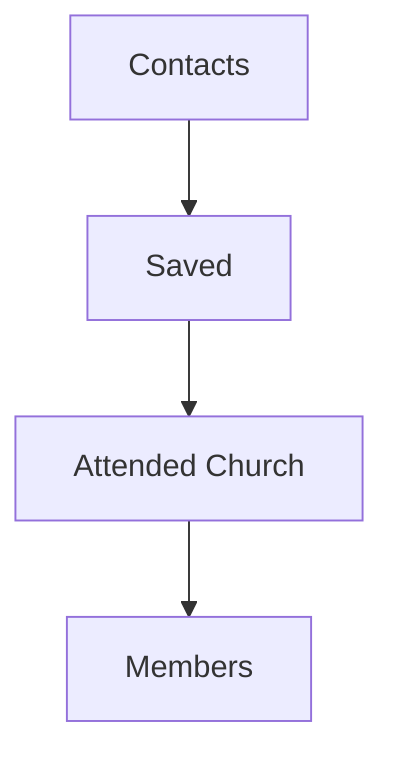

# Church Management Tracker - Leadership Analytics Guide

Target role: Church Leadership — pastors, elders, deacons, and senior leaders using Church Management Tracker system-wide insights for oversight and decision-making.

Responsibilities
- Review growth, conversion, and engagement trends
- Interpret cross-module KPIs and identify action priorities
- Monitor data quality signals impacting decision confidence
- Direct ministry focus using funnel and attendance insights
- Request targeted exports and reports for boards and stakeholders

## Related Modules
- [Dashboard and Analytics](../modules/dashboard-analytics.md) - Cross-module KPIs and analytics
- [Central Members](../modules/central-members.md) - Member engagement and quality data
- [Evangelism and Contacts](../modules/evangelism.md) - Outreach effectiveness metrics
- [First Timers](../modules/first-timers.md) - Conversion funnel analytics
- [Sunday Service](../modules/sunday-service.md) - Attendance trends and patterns
- [Import and Export](../modules/import-export.md) - Data exports for reporting

Screenshot: Dashboard — Overview with date filter applied

1. Dashboard overview and interpretation

Goal: get a reliable, at-a-glance understanding of church health and growth using Church Management Tracker.

Procedure
1. Open Dashboard.
2. Set Date Range to the period under review for example last 90 days or current quarter.
3. Read Totals and Growth Rates:
   - Totals: totalContacts, totalMembers, totalFirstTimers, totalServices.
   - Growth: contactsThisMonth, membersThisMonth, firstTimersThisMonth, servicesThisMonth.
4. Review Conversion Funnel:
   - Contacts → Saved → Church Attendees → Members with counts and percentages.
5. Check Engagement and Quality:
   - Engagement: distribution of Regular, Irregular, Dormant.
   - Data Quality: averageScore, recordsNeedingReview, completenessPercentage.
6. Scan Activity Feed for notable recent events converts, services, bulk updates.
7. Drill into charts time series, distributions; confirm trends align with expectations.

Pro tips
- Keep one consistent comparison window month to date vs previous month for leadership meetings.
- Use engagement distribution shifts to guide pastoral care initiatives.

Common pitfalls and how to avoid them
- Mixing time windows: align all charts and KPIs to the same date range before presenting.
- Ignoring data quality: low averageScore or high needsReview reduces confidence in conclusions.

Success metrics
- M/M improvement in funnel stage conversion rates
- Stable or rising engagement among Regular members
- Increasing completenessPercentage and decreasing recordsNeedingReview

Integration points
- Funnel combines Evangelism, Sunday Service, First Timers, and Central Members.
- Data quality is sourced from Central Members validation/quality scoring.

Screenshot: Dashboard — Conversion Funnel detail

2. Cross-module analytics and insights

Goal: connect dots across outreach, attendance, first-time visits, and membership to inform strategy.

Procedure
1. Set a comparable Date Range across modules via Dashboard filters.
2. Compare Evangelism category distributions with First Timers volumes:
   - Do weeks with more responsive contacts correlate with more first timers?
3. Compare First Timers conversion eligibility with new Members:
   - Are eligible first timers converting within expected time frames?
4. Match Sunday attendance highs with conversion or saved spikes:
   - Were special events or campaigns reflected in outcomes?
5. Cross-check engagement (Regular vs Dormant) against attendance trends:
   - Are dips driven by fewer services, seasonality, or engagement issues?

Pro tips
- Track three anchor metrics together: likelyToCome ratio, firstTimersThisMonth, membersThisMonth.
- Keep a running list of hypotheses and validate across the next 4–6 weeks to confirm effectiveness.

Common pitfalls and how to avoid them
- Over-attribution to a single event: verify with multi-week trend confirmation.
- Not adjusting for seasonality: compare with the same period last year where possible.

Success metrics
- Established link between outreach quality and first-timer volume
- Predictable conversion throughput from eligibility to membership

Integration points
- Evangelism inviter attribution flows into conversion recognition reports via Central Members.

Screenshot: Dashboard — Cross-Module Analytics view

3. Growth tracking and trend analysis

Goal: detect growth patterns, seasonality, and momentum to plan next steps.

Procedure
1. In Dashboard, open Time Series charts for contacts, first-timers, members, and attendance.
2. Switch between last 12 weeks and last 12 months to detect weekly vs seasonal effects.
3. Identify trends:
   - Positive: consistent higher highs and higher lows.
   - Negative: successive declines or increased volatility.
4. Confirm leading indicators:
   - Growth in responsive contacts or likelyToCome precedes first-timers and then members.
5. Document actions:
   - Increase follow-up staffing during rising first-timer waves.
   - Plan retention activities if engagement dips precede attendance declines.

Pro tips
- Use a 4-week moving average view to smooth short-term noise.
- Triangulate with external context school calendar, holidays, weather where relevant.

Common pitfalls and how to avoid them
- Reacting to one-week spikes: base changes on 3–4 point trend confirmation.
- Missing lag effects: allow for normal delay between stages outreach → attendance → membership.

Success metrics
- Positive 3-month trend in membersThisMonth
- Attendance trend aligned with outreach quality and follow-up capacity

Integration points
- Time series are recomputed from module events in real time; filters keep comparisons consistent.

Screenshot: Dashboard — Attendance and Membership trends

4. Conversion funnel monitoring

Goal: improve throughput at each stage from contact to member.

Procedure
1. Open Conversion Funnel and note stage counts and percentages:
   - Contact → Saved → Attended Church → Member.
2. Identify the weakest stage conversion:
   - Example: saved → attendance at 15 percent vs expected 25–30 percent.
3. Assign a corrective action:
   - Saved → Attendance gap: adjust follow-up cadence, invitation strategy, or transportation help.
   - Attendance → Member gap: improve first-timer nurturing and clarity on next steps.
4. Set a target and timeframe:
   - Raise saved → attendance to 25 percent in 6 weeks.
5. Track weekly; confirm sustained improvement before closing the action item.

Pro tips
- Recognize and celebrate inviters and teams with above-average outcomes to reinforce behaviors.
- Keep the funnel definitions stable to maintain comparability across periods.

Common pitfalls and how to avoid them
- Shifting definitions mid-quarter: lock definitions until after the reporting period ends.
- Over-indexing on top-of-funnel without capacity for follow-up: balance resources across stages.

Success metrics
- Stage conversion improvements of 3–5 percentage points sustained over 2+ months
- Reduced drop-off between attendance and membership

Integration points
- Funnel is driven by Evangelism flags saved, attendedChurch and First Timers conversion signals.

Mermaid overview

Screenshot: Dashboard — Funnel stage drilldown

5. Strategic decision support using data

Goal: run leadership cadences that translate analytics into focused action.

Monthly leadership cadence
1. Pre-read dashboard with last 90 days filter and prior 90 days for context.
2. Review:
   - Growth KPIs: contactsThisMonth, membersThisMonth.
   - Funnel: identify the lowest stage conversion and assign one corrective action.
   - Engagement: Dormant trend and data quality warnings.
3. Decide:
   - Three priorities with owners, SLAs, and expected KPI movement.
4. Communicate:
   - Share highlights, wins, and changes with ministry leaders.

Quarterly board cadence
1. Export summary datasets via Universal Export contacts, first timers, membership, attendance.
2. Produce a one-page KPI pack:
   - Trends, funnel, engagement, data quality status.
3. Record lessons learned and adjust goals for the next quarter.

Pro tips
- Use the same template each month to track progress and reduce preparation time.
- Tie goals to measurable KPI deltas for accountability.

Common pitfalls and how to avoid them
- Analysis without action: mandate owner and due date for each insight.
- Too many goals: limit to three focus items per month.

Success metrics
- On-time completion of monthly actions
- KPI deltas realized within the planned timeframe
- Improved engagement distribution and higher average data quality score

## Related Documentation
- [Documentation Hub](../README.md) - Main documentation index for Church Management Tracker
- [User Guide Index](README.md) - Overview of all user workflows
- [Ministry Leader Workflows](ministry-leader-workflows.md) - Performance monitoring and team coordination
- [Common Procedures](common-procedures.md) - Generating reports and exports from Church Management Tracker